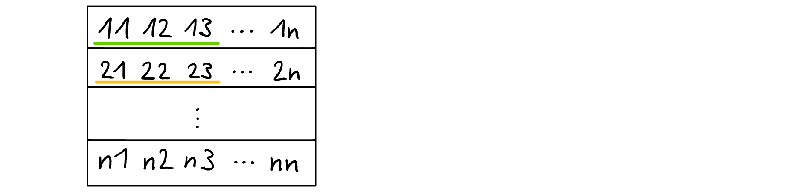

## Task 1 - Mandelbrot set


Generated mandelbrot.png:


Possibilities to improve performance:

* Avoiding unnecessary calculations:
  For example: Calculate `cy` before second for-loop
* Use optimization flags:
  I used `-O1` for execution on LCC2 because it was the fastest

Parallelizing the program:

* Every loop could be executed parallel:
  T1: executes `cy`
  T2: executes `cx`
  T3: executes while with condition
  -> they all have to be synchronized
* Parallelize by splitting data:
  Split the image in equal parts and let every Thread calculate the values for these different (X,Y)-pairs
  -> This would be the better variant for it, because every Thread would do the same amount of work, in the first described approach  that isn't the case.


## Task 2 - Hadamard product


### Theoretical background

The Hadamard product is the component wise product of two matrices. In this exercise the Hadamard product will be computed with two 2D-arrays in a C program in two different variants. The first variant accesses the array elements row by row, the second variant column by column.

first variant:

```c
for (size_t i = 0; i < n; ++i) {
    for (size_t j = 0; j < n; ++j) {
        c[i][j] = a[i][j] * b[i][j];
    }
}
```

second variant:

```c
for (size_t j = 0; j < n; ++j) {
    for (size_t i = 0; i < n; ++i) {
        c[i][j] = a[i][j] * b[i][j];
    }
}
```

Since 2D-arrays are stored row by row in the memory, and data is accessed row by row in the first code snippit, data locality is being exploited in the cache in this case, thus cache misses are avoided. In the second code snippit data is accessed column by column and cache misses are provoked.

For instance, let us assume the following array:



 As mentioned, the array is stored row by row in the memory like this:


Then the procedure for the first variant would look like this, assuming the cache line offers space for 3 elements:

1. accessing element $11$, initial cache miss, write in cache
   
2. accessing element $12$, cache hit
3. accessing element $13$, cache hit
4. accessing element $14$, cache miss, write in cache
   

On the other hand the procedure for the second variant would look like this:

1. accessing element $11$, initial cache miss, write in cache
   
2. accessing element $21$, cache miss, write in cache
   

In these procedures it becomes obvious that in the second variant, there is a cache miss with every access, whilst in the first variant cache hits are achieved.

### Mathematical propositions

For the first variant, the number of cache misses can be calculated by the following function:
$$
f_{1}(n, s) = \frac{8n^2}{s}
$$

In the cache line $\frac{s}{4}$ elements can be stored, so the cache line size divided by the size of one element in bytes. That means that after $\frac{s}{4}$ many elements there will be a cache miss.
So the $n^2$ accesses get divided by $\frac{s}{4}$ and everything is getting multiplied by 2 because there are two matrices.

The cache misses of the second variant can be calculated by the following function:
$$
f_{2}(n) = 2n^2
$$

In this case with every access a cache miss occurs, because the cache line gets wiped with every access when accessing element column by column.

### Analysis with 'cachegrind'

Enough theoretical discussion at this point, let's calculate with concrete numbers:

On the LCC2 cachegrind simulates an level-1 data cache with a cache line size of 64 bytes. In the programs in which we calculate the Hadamard product the matrix size is set to 700 by 700 elements. If we put these numbers into the formulas determined above we get the following result for the amount of cache misses with the first variant:
$$
f_{1}(700, 64) = \frac{8*700^2}{64} = 61\ 250
$$
And the corresponding result for the second variant:
$$
f_{2}(700) = 2*700^2 = 980\ 000
$$
With the output from cachegrind we can check if these calculations correspond to the simulation. The essential value in the following output of cachegrind is the line in which the element wise product is computed, in the column of ``D1mr``, which equates with the occurring cache misses when reading from the layer-1 data cache (``D1mr``: **D**ata level **1** cache **m**issing **r**eads). At this point in the table cachegrind indicates $61\ 251$ cache misses for the first variant of the Hadamard product computation, which roughly matches the calculated value above:

```
--------------------------------------------------------------------------------
-- User-annotated source: /home/cb76/cb761027/PP/Assignment2/a2a.c
--------------------------------------------------------------------------------
        Dr   D1mr   DLmr      Dw   D1mw   DLmw

         .      .      .       .      .      .  #include <stdlib.h>
         .      .      .       .      .      .
         0      0      0       7      0      0  int main() {
         .      .      .       .      .      .
         0      0      0       1      0      0      size_t n = 700;
         .      .      .       .      .      .
         2      0      0       3      0      0      int32_t a[n][n];
         6      0      0      13      0      0      int32_t b[n][n];
         7      0      0      13      0      0      int32_t c[n][n];
         .      .      .       .      .      .
     2,102      0      0       1      0      0      for(size_t i = 0; i < n; ++i) {
 1,471,400      0      0     700      0      0          for(size_t j = 0; j < n; ++j) 
 5,390,000 61,251 61,179 490,000 30,626 30,626              c[i][j] = a[i][j] * b[i][j];
         .      .      .       .      .      .          }
         .      .      .       .      .      .      }
         .      .      .       .      .      .
         3      1      0       1      0      0      c[0][0]++;
         .      .      .       .      .      .
         0      0      0       0      0      0      return EXIT_SUCCESS;
         7      1      0       0      0      0  }
```

With the second variant the number of simulated cache misses ($980\ 000$) equals with the calculation as well:

```
--------------------------------------------------------------------------------
-- User-annotated source: /home/cb76/cb761027/PP/Assignment2/a2b.c
--------------------------------------------------------------------------------
        Dr    D1mr   DLmr      Dw    D1mw   DLmw

         .       .      .       .       .      .  #include <stdlib.h>
         .       .      .       .       .      .
         0       0      0       7       0      0  int main() {
         .       .      .       .       .      .
         0       0      0       1       0      0    size_t n = 700;
         .       .      .       .       .      .
         2       0      0       3       0      0    int32_t a[n][n];
         6       0      0      13       0      0    int32_t b[n][n];
         7       0      0      13       0      0    int32_t c[n][n];
         .       .      .       .       .      .
     2,102       0      0       1       0      0    for(size_t j = 0; j < n; ++j) {
 1,471,400       0      0     700       0      0        for(size_t i = 0; i < n; ++i) {
 5,390,000 980,000 61,164 490,000 490,000 30,626            c[i][j] = a[i][j] * b[i][j];
         .       .      .       .       .      .        }
         .       .      .       .       .      .    }
         .       .      .       .       .      .
         3       1      0       1       0      0    c[0][0]++;
         .       .      .       .       .      .
         0       0      0       0       0      0    return EXIT_SUCCESS;
         7       1      0       0       0      0  }
```

**side note**: These excerpts of cachegrind outputs are not complete and cut down for neater text formatting, screenshots of the full excerpts, can be found in the appendix of this assignment (``/task2/cachegrind-output``).

### Analysis with 'perf'

When analyzing the behavior of the computations in the real world, perf yields different data as cachegrind. In case of the first variant there are $10\ 483$ registered cache misses which is far less than the theoretical $61\ 250$ (or $61\ 251$) cache misses. This indicates that in the real world some other optimizations come into affect, resulting in approximately $17\%$ of the theoretical cache misses:

``` 
 Performance counter stats for './a2a':

           7875693      L1-dcache-loads:u
             10483      L1-dcache-loads-misses:u  #    0.13% of all L1-dcache hits

       0.008103076 seconds time elapsed
```

On the other hand the results for the second variant are way more drastic. Only $116\ 946$ cache misses occur, which results in just $11\%$ of the theoretical cache misses:

``` 
 Performance counter stats for './a2b':

           8468287      L1-dcache-loads:u
            116301      L1-dcache-loads-misses:u  #    1.37% of all L1-dcache hits

       0.009955886 seconds time elapsed
```

I am not sure about the correctness about these measurements, maybe the compiler optimizes a whole fricking lot at this point, but in my point of view these differences seem pretty radical.

Other than that the execution time for the second variant is higher than the execution time for the first variant, which is expected, but it is not that much higher in this case. Theoretical it would be much higher than that in comparison with the first variant, because cache misses should be much more frequent.


## Task 3 - Monte Carlo approximation


| number_of_threads | execution time of parallel version (s) |
| ---- | ---- | ---- |
| 1 |8.63049 |
| 2 |4.321962 |
| 3 |2.878392 |
| 4 |2.161139 |
| 5 |1.729045 |
| 6 |1.441192 |
| 7 |1.23698 |
| 8 |1.088379 |

Execution time for serial version: 15.344928

### Explanations

- Execution time of serial version is higher then parallel version with one thread because serial version uses ```rand()```, which seems to slower then ```rand_r()``` (used by parallel version). If one substitutes ```rand()``` by ```rand_r()``` in the serial version, execution time drops to 8.6 seconds.
- Performance increase seems to be significant (Speedup = 7,93)
- Further performance improvements could probably be made by distributing the summation process to multiple threads.