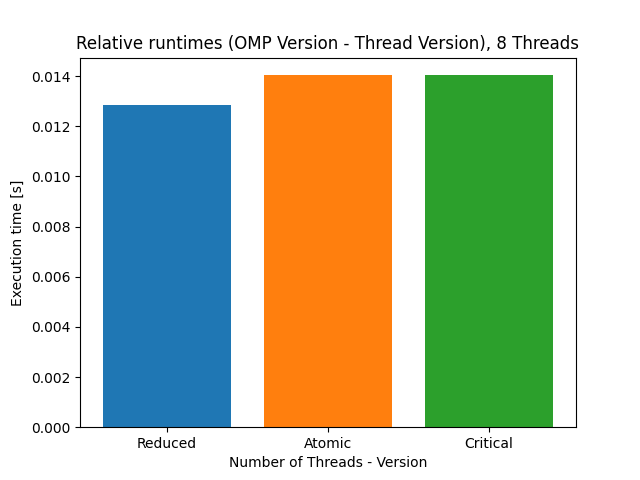
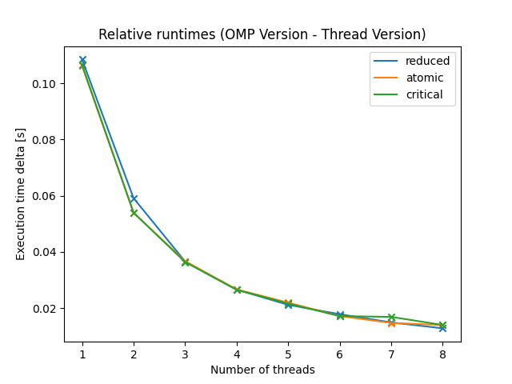

# Assignment 3

by Tobias Hosp, Marcel Alexander Huber and Thomas Klotz

## Task 1

### Measurements on LCC2

Total execution times for OMP-Versions with ```Critical```, ```Atomic``` and ```Reduction``` constructs. Execution times from last weeks parallel version using pthreads is also provided. Everything got compiled with -Ofast flag. 


One can observe that the total runtimes seem to be very close together. To get a better picture of the situation, one can watch the following diagrams. All of those print the execution times of the omp versions subtracted by the execution time of the pthread version.


All versions seem to be sligthly slower (0.1s) for only one thread. This is probably due to overhead produced by the runtime system. 



The omp versions are still slower then the pthread version when getting executed with 8 threads. However, the delta decreased from 0.1 seconds to ~0.04 to ~0.02 seconds. The differences in execution time of the different omp versions are within margin of error and cannot be reproduced upon repeated execution. 



The deltas in omp runtime vs pthread runtime suggest that OMP gets more efficient the more threads are used.

Following data was used to create the plots:

| number_of_threads | thread version | reduced version | atomic version | critical version |
| ----------------- | -------------- | --------------- | -------------- | :--------------- |
| 1                 | 8.035584       | 8.144062        | 8.141868       | 8.142125         |
| 2                 | 4.021773       | 4.080918        | 4.075714       | 4.075752         |
| 3                 | 2.681191       | 2.717831        | 2.717898       | 2.717617         |
| 4                 | 2.011988       | 2.038604        | 2.038685       | 2.038528         |
| 5                 | 1.609647       | 1.630848        | 1.631626       | 1.631307         |
| 6                 | 1.342244       | 1.360112        | 1.359467       | 1.359431         |
| 7                 | 1.151712       | 1.166655        | 1.166459       | 1.168626         |
| 8                 | 1.017521       | 1.030363        | 1.031557       | 1.031552         |

### Using /usr/bin/time

