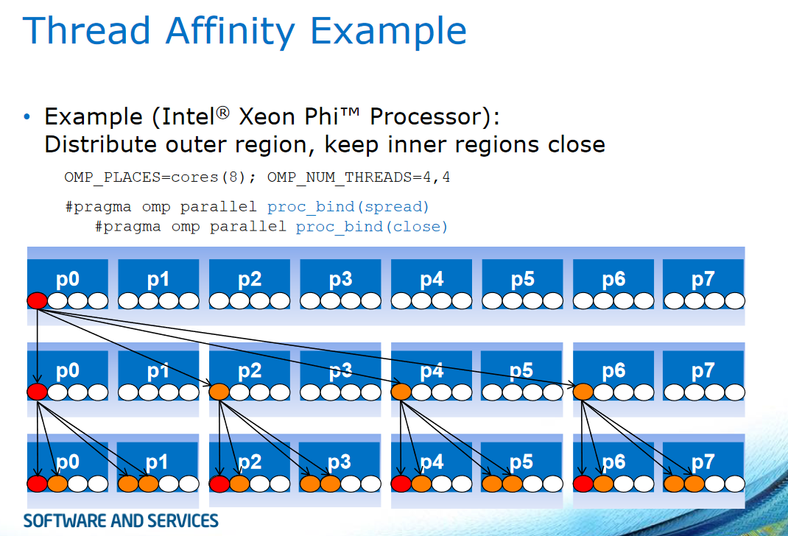

## Task1

### Writing the basic program

To achieve a execution time of at least 2 seconds, by incrementing an integer value, i used a volatile integer variable. Volatile variables can't be cached, so they're always fetched from the memory -> much longer execution time.
With 1900000000 iterations on my local machine respectively 1000000000 on lcc2 with 1 thread and optimization flag -O3, the program needs about 2 seconds to execute completely. I think without volatile, just with a normal int, it is almost impossible to get an execution time that high.

### OpenMP 4.0 Affinity

The developer has the opportunity to decide on how many PLACES(hyperthreads, cores, sockets,...) the threads are executed. Places can be set with the Environment variables OMP_PLACES and the num threads variable could then look like this for 8 places: OMP_NUM_THREADS=4,4

#### Predifined places:

- cores: physical cores
- threads: hyperthreads
- sockets: processor package

#### Affinity policies:

- spread: spread threads evenly among places
- close: place threads near master thread
- master: collocate thread with master thread

#### Example:



#### Measurements:

4 Threads basic program, just with -O3: 2.45598

4 Threads with omp parallel for optimization:

```c
#pragma omp parallel for
	for (long i = 0; i < n; i++) {
		inc++;
	}
```

Measure: 0.78777 seconds

2,2 Threads with just omp proc_bind(spread):

```c
#pragma omp parallel proc_bind(spread)
	for (long i = 0; i < n; i++) {
		inc++;
	}
```

Measure: 2.94504 seconds
-> just proc_bind doesn't do it

Using 2,2 threads omp parallel for and proc_bind(spread) before it:

```c
#pragma omp parallel proc_bind(spread)
    #pragma omp parallel for
		for (long i = 0; i < n; i++) {
		    inc++;
		}
```

Measure: 0.00014 seconds

Trying proc_bind(spread) with proc_bind(close) after it and before omp parallel for:

```c
#pragma omp parallel proc_bind(spread)
        #pragma omp parallel proc_bind(close)
            #pragma omp parallel for
		        for (long i = 0; i < n; i++) {
			        inc++;
		        }
```

Measure: 0.00018
-> so combining proc_bind(close) with proc_bind(spread) doesn't do anything in this case, actually it's a little bit slower

### First Conclusion:

So splitting the threads with proc_bind(spread) and omp parallel for looks like a really good option to optimize the code, because it went from about 2.4 seconds to 0.00014 seconds.
But what's the best way to define the PLACES?

### Measure PLACES:

| number_of_threads | PLACES=cores(4) | PLACES=threads(4) | PLACES=sockets(4) |
| ----------------- | --------------- | ----------------- | ----------------- |
| 2,2               | 0.00015         | 0.00012           | 0.00021           |

### Final Conclusion:

So the predifined places as hyperthreads are the fastest in this case. Places can also be defined by the developer like this for example:
OMP_PLACES="{0,1},{2,3},{4,5},{6,7},{8,9},{10,11},{12,13},{14,15}"
this would equal 8 places with 2 "slots" each

But the predifined worked quite well in this case, so I used them.

Another thing to mention too is that it is important obviously how many physical cores you have. So if there are more threads than PLACES or cores the developer has to check how they will be placed by using a specififc affinity.

### Resources:

- https://www.lrz.de/services/compute/courses/x_lecturenotes/mic_workshop_2017/Michael-Klemm-tutorial.pdf
- https://www.openmp.org//wp-content/uploads/openmp-examples-4.0.2.pdf
