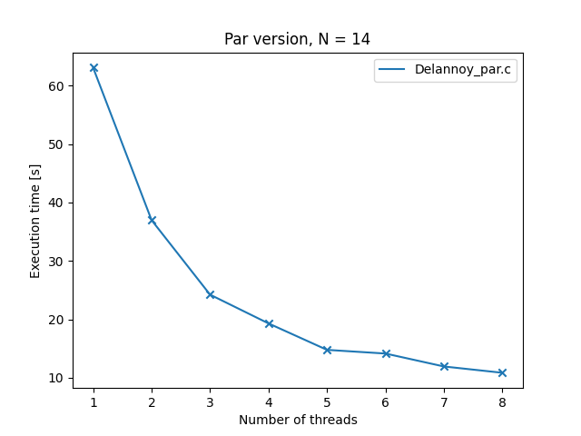
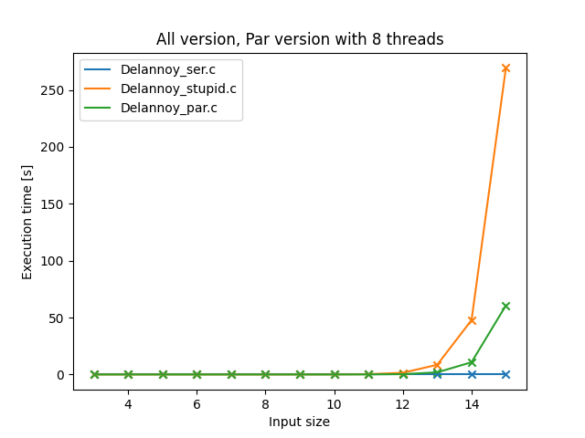
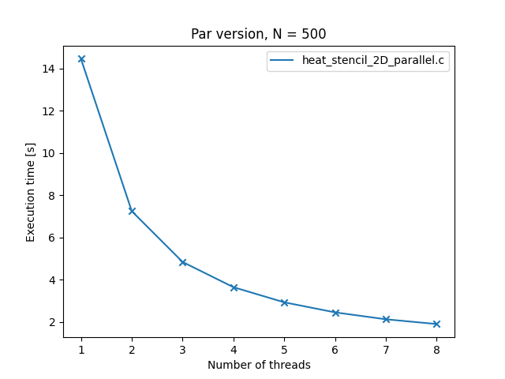
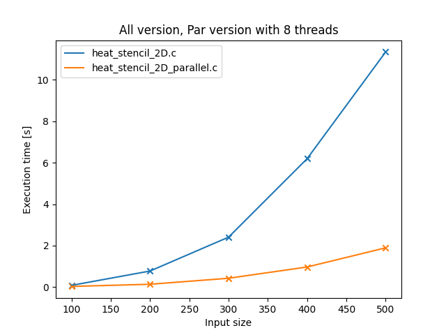

# Assignment 5
by Tobias Hosp, Marcel Alexander Huber and Thomas Klotz

## Task 1

### Sequential implementation, first try

A dynamic programming approach has been chosen for the first sequential implementation.

```c
#include <stdio.h>
#include <stdlib.h>
#include <omp.h>

int main(int argc, char** argv){

    int matrix_size = 0;

    if(argc < 2){
        printf("usage: ./delannoy_ser.out <gridsize>\n");
        return EXIT_FAILURE;
    } else {
        matrix_size = atol(argv[1]);
    }

    long delannoy_array[matrix_size+1][matrix_size+1];

    #ifdef TIME
    double start_time = omp_get_wtime();
    #endif

    for (int i = 0; i <= matrix_size; i++){
        delannoy_array[0][i] = 1;
        delannoy_array[i][0] = 1;
    }


    for (int i = 1; i<=matrix_size; i++){
        for (int j = 1; j<=matrix_size; j++){
            delannoy_array[i][j] = delannoy_array[i-1][j] + delannoy_array[i][j-1] + delannoy_array[i-1][j-1];
        }
    }
    #ifdef TIME
    double end_time = omp_get_wtime();
    printf("time: %2.9f \n",end_time-start_time);
    #endif

    #ifndef TIME
    printf("delanoy number for given input: %ld\n", delannoy_array[matrix_size][matrix_size]);
    #endif
    return EXIT_SUCCESS;
}

```

### Sequential implementation, second try

Although this leads to **superior** execution times, we chose to implement a naive recursive implementation, because parallelizing the first approach was way too hard for way too less benefit.

```C
#include <stdio.h>
#include <stdlib.h>
#include <omp.h>


long calculate_delanoy(int m, int n){
    if(m == 0 || n == 0){
        return 1;
    } else{
        return calculate_delanoy(m-1, n) + calculate_delanoy(m-1, n-1) + calculate_delanoy(m, n-1);
    }
}

int main(int argc, char** argv){

    int problem_size;

    if(argc < 2){
        printf("usage: ./delannoy_stupid.out <gridsize>\n");
        return EXIT_FAILURE;
    } else {
        problem_size = atol(argv[1]);
    }

    #ifdef TIME
    double start_time = omp_get_wtime();
    calculate_delanoy(problem_size, problem_size);
    double end_time = omp_get_wtime();
    printf("time: %2.9f \n",end_time-start_time);
    #endif

    #ifndef TIME
        printf("delanoy number for given input: %ld\n", calculate_delanoy(problem_size, problem_size));
    #endif
}


```

### Parallel implementation

At last, the parallel implementation has been implemented. Note that for problem sizes < 8, it degrades to a serial version.

```c
#include <stdio.h>
#include <stdlib.h>
#include <omp.h>

#define PAR_BORDER 8

long calculate_delanoy(int m, int n){
   
    
    if(m == 0 || n == 0){
        return 1;
    } else{

        if(m < PAR_BORDER || n < PAR_BORDER){
            return calculate_delanoy(m-1, n) + calculate_delanoy(m-1, n-1) + calculate_delanoy(m, n-1);
        }else{
            long i, j, k;

        #pragma omp task shared(i)
            i = calculate_delanoy(m-1, n);

        #pragma omp task shared(j)
            j = calculate_delanoy(m-1, n-1);
        
            k = calculate_delanoy(m, n-1);
        
        #pragma omp taskwait
            return  i+j+k;
        }

    }
    
}

int main(int argc, char** argv){
    int problem_size;
    if(argc < 3){
        printf("usage: ./delannoy_stupid.out <gridsize> <num_threads>\n");
        return EXIT_FAILURE;
    } else {
        problem_size = atol(argv[1]);
        omp_set_num_threads(atol(argv[2]));
    }

    #ifdef TIME
    double start_time = omp_get_wtime();
    #pragma omp parallel
    {
        #pragma omp single
        calculate_delanoy(problem_size, problem_size);
    }

    double end_time = omp_get_wtime();
    printf("time: %2.9f \n",end_time-start_time);
    #endif

    #ifndef TIME
        long result = 0;
        #pragma omp parallel
        {
            #pragma omp single
            result = calculate_delanoy(problem_size, problem_size);
        }
        printf("delanoy number for given input: %ld\n",result);
    #endif
}
```

### Benchmarking the programs

First lets have a look at the parallel version. The following plot shows the runtime / number of threads with a grid size of 14.



| Number of threads | Delannoy_par.c |
| :---------------: | -------------- |
|         1         | 63.069420405   |
|         2         | 36.972000871   |
|         3         | 24.222075164   |
|         4         | 19.299128868   |
|         5         | 14.775556456   |
|         6         | 14.145386335   |
|         7         | 11.932384551   |
|         8         | 10.85476562    |

With this implementation, speedup at 8 threads is $S = \frac{Runtime\ with\ one\ thread}{Runitme\ with\ eight\ threads} = \frac{63.069}{10.854} = 5.81 $ . 

Lets compare the parallel version with the sequential versions of the program. The following plot shows all three versions of the program with execution times / varying inputs sizes. Note that ``Delannoy_stupid.c`` is the naive recursive variant and ```Delannoy_ser.c``` is the dynamic programming variant.



| Input size | Delannoy_ser.c | Delannoy_stupid.c | Delannoy_par.c |
| :--------: | :------------- | ----------------- | -------------- |
|     3      | 5.59e-07       | 8.08e-07          | 0.000306796    |
|     4      | 4.69e-07       | 2.701e-06         | 0.003206804    |
|     5      | 3.32e-07       | 1.1913e-05        | 0.000289265    |
|     6      | 3.69e-07       | 6.0286e-05        | 0.000344332    |
|     7      | 3.61e-07       | 0.000325188       | 0.003180426    |
|     8      | 3.84e-07       | 0.001726981       | 0.001208156    |
|     9      | 3.87e-07       | 0.009286419       | 0.002462596    |
|     10     | 4.25e-07       | 0.051500283       | 0.017246157    |
|     11     | 4.54e-07       | 0.275242675       | 0.065679599    |
|     12     | 4.54e-07       | 1.520545691       | 0.322373971    |
|     13     | 4.77e-07       | 8.515616205       | 1.887385637    |
|     14     | 5.44e-07       | 47.818835113      | 10.757425085   |
|     15     | 5.48e-07       | 269.416411988     | 60.649550319   |

We observed the following:

- For input sizes < 8 the times of the parallel and naive sequential implementation should be roughly the same. However, the parallel version seems to be slower for these input sizes. This is probably due to OMP overhead.
- Relevant speedup for serial vs parallel can be observed for input problems > 13. For smaller input problems, speedup is very tiny.
- The dynamic programming variant is significantly faster then both other variants in all cases.

### Conclusion

Although parallelism is a great option for making programs run faster, it is not always the best solution. Sometimes a better algorithm (like the dynamic programming one) is far superior compared to a parallelized naive algorithm.


## Task 2

To calculate the temperature of a field, the temperature of the neighbor fields are getting drawn in. So for the whole grid (2D array) of fields this is done for every field with every time step. This results in two for loops which are independent of each other, thus the operation can get parallelized with the usage of the ``collapse`` statement. Additionally the 2D arrays ``A`` and ``B`` get declared as ``shared`` and the coordinates of the source and the size of the array get declared as ``firstprivate``.

```c
for (int t = 0; t < T; t++) {
    #pragma omp parallel for default(none) shared(A,B) firstprivate(source_x, source_y,N) collapse(2)
    for (int i = 0; i < N; i++){
        for (int j = 0; j < N; j++){            
		   if(i == source_x && j == source_y){
                B[IND(i,j)] = A[IND(i,j)];
                continue;
            } 

            double leftNeighbour = getValue((i-1),j,A,N);
            double rightNeighbour = getValue((i+1),j,A,N);
            double topNeighbour = getValue(i,(j-1),A,N);
            double bottomNeighbour = getValue(i,(j+1),A,N);

            B[IND(i,j)] = (leftNeighbour + rightNeighbour + topNeighbour + bottomNeighbour)/4.0;
        }
    }
    double* temp;
    temp = B;
    B = A;
    A = temp;
}
```

### Time measurements for different thread counts

With increasing count of threads the execution time gets reduced drastically. The scaling seems pretty ideal.



| Number of threads | heat_stencil_2D_parallel.c |
| ----------------- | -------------------------- |
| 0                 | 14.45732                   |
| 1                 | 7.24219                    |
| 2                 | 4.83667                    |
| 3                 | 3.64234                    |
| 4                 | 2.92593                    |
| 5                 | 2.44938                    |
| 6                 | 2.12228                    |
| 7                 | 1.89677                    |

### Time measurements for different problem sizes


| Input size | heat_stencil_2D.c | heat_stencil_2D_parallel.c |
| ---------- | ----------------- | -------------------------- |
| 100        | 0.0842            | 0.03282                    |
| 200        | 0.77569           | 0.13773                    |
| 300        | 2.41044           | 0.42669                    |
| 400        | 6.19729           | 0.97009                    |
| 500        | 11.34769          | 1.89605                    |


Speedup for problem size N=500 and 8 threads:
$$
Speedup = \frac{11.34569s}{1.89605s} \approx 5.98
$$
