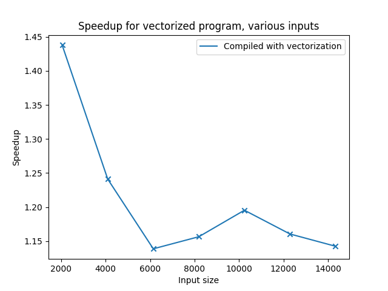

# Assignment 7
by Tobias Hosp, Marcel Huber and Thomas Klotz

## Task 1

### Relevant Code

```c
void calculate_array(float* a, float* b, float* c, int size){
    for(int run=0; run<REPETITIONS; ++run){
        for(int i = 0; i<size; ++i){
            a[i] += b[i] * c[i];
        }
    }
}
```

Compiled with: 

```makefile
gcc -std=gnu11 -fopenmp -O1 -D TIMES -ftree-vectorize 
```

### Enable Vectorization

To enable vectorization, the compiler flag ```-ftree-vectorize ``` was added to the usual gcc call.

### Results



| Input size | compiled without vectorization | compiled with vectorization |
| :--: | :--: | :--: |
| 2048 | 2.4803 | 1.7238 |
| 4096 | 5.793 | 4.6847 |
| 6144 | 8.4365 | 7.3953 |
| 8192 | 11.3653 | 9.8444 |
| 10240 | 14.6792 | 12.3173 |
| 12288 | 17.1076 | 14.8477 |
| 14336 | 19.6561 | 17.2127 |

### Obersvations

- The result stays correct, independent of whether the code is compiled with vectorization or without.
- Enabling vectorization results in a speedup of ~1.44, decreasing with bigger input sizes to ~1.2

### Perf

The only event with a relevant counter reading was ```SIMD_INST_RETIRED.VECTOR```, with a reading of **1.026.004.338**.
This number is abould **half** of the number of iterations in the compute loop. 

### Useful resources

[Register sizes of different SIMD standards](https://twiki.cern.ch/twiki/bin/view/CMSPublic/WorkBookWritingAutovectorizableCode)

[Stackoverflow for vectorization flag](https://stackoverflow.com/questions/51232100/gcc-auto-vectorization)


