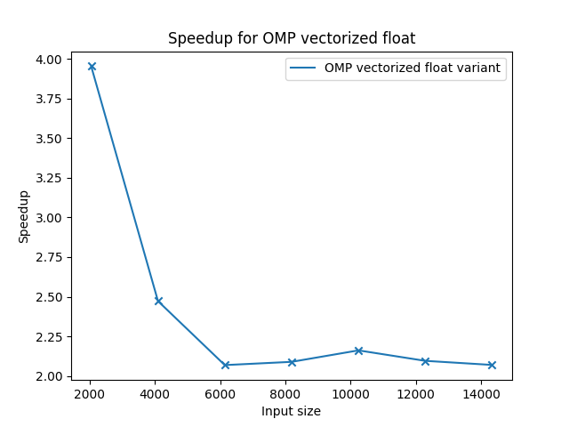
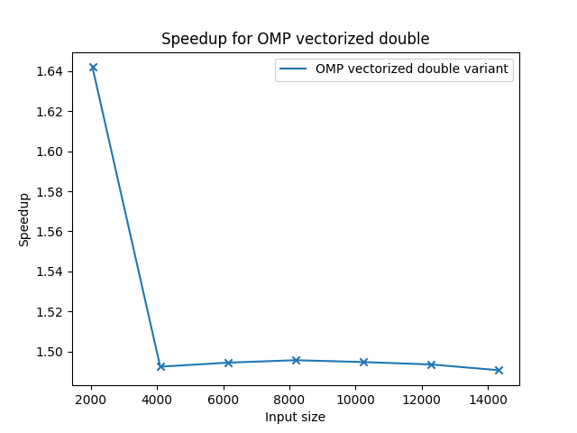
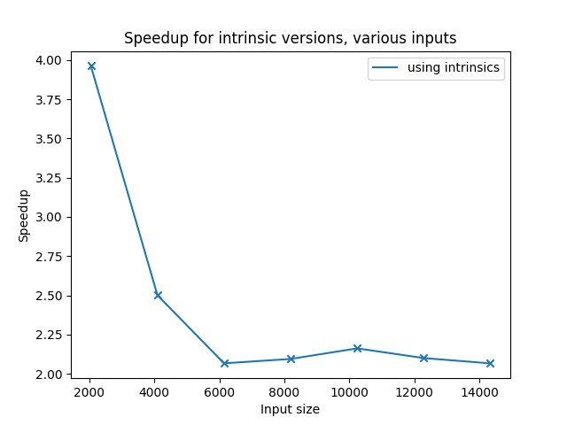
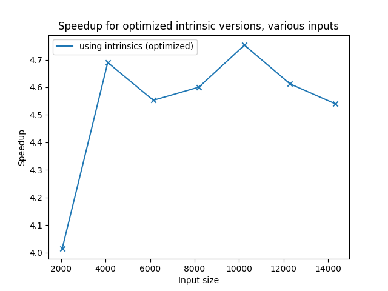

# Assignment 7

by Tobias Hosp, Marcel Huber and Thomas Klotz

## Task 1

### Relevant Code

```c
void calculate_array(float* a, float* b, float* c, int size){
    for(int run=0; run<REPETITIONS; ++run){
        for(int i = 0; i<size; ++i){
            a[i] += b[i] * c[i];
        }
    }
}
```

Compiled with:

```makefile
gcc -std=gnu11 -fopenmp -O1 -D TIMES -ftree-vectorize -msse4.1
```

### Enable Vectorization

To enable vectorization, the compiler flag `-ftree-vectorize ` was added to the usual gcc call.

### Results


| Input size | Compiled without vectorization | Compiled with vectorization |
| ---------- | ------------------------------ | --------------------------- |
| 2048       | 2.4803                         | 1.725                       |
| 4096       | 5.793                          | 4.6677                      |
| 6144       | 8.4365                         | 7.4088                      |
| 8192       | 11.3653                        | 9.8276                      |
| 10240      | 14.6792                        | 12.2802                     |
| 12288      | 17.1076                        | 14.7419                     |
| 14336      | 19.6561                        | 17.2051                     |

### Obersvations

- The result stays correct, independent of whether the code is compiled with vectorization or without.
- Enabling vectorization results in a speedup of ~1.44, decreasing with bigger input sizes to ~1.2

### Perf

Results for the perf measured events with an input size of 2048:

| Event                           | Value         |
| ------------------------------- | ------------- |
| SIMD_INST_RETIRED.PACKED_SINGLE | 1,024,001,590 |
| SIMD_INST_RETIRED.SCALAR_SINGLE | 2             |
| SIMD_INST_RETIRED.PACKED_DOUBLE | 0             |
| SIMD_INST_RETIRED.SCALAR_DOUBLE | 4,097,000,054 |
| SIMD_INST_RETIRED.VECTOR        | 3,584,000,126 |
| SIMD_INST_RETIRED.ALL           | 5,121,001,732 |

The relevant information is SIMD_INST_RETIRED.PACKED_SINGLE, since this event describes, how many operations are vectorized operations for single percision floating point numbers (floats). Since this number is roughly half of the iterations in the compute loop, we would expect a speedup of ~2.
At this point we do not know why we do not get a speedup of 2, nor do we know why there is such a high count of scalar double, although there are nearly no doubles used in the code.

### Useful resources

[Register sizes of different SIMD standards](https://twiki.cern.ch/twiki/bin/view/CMSPublic/WorkBookWritingAutovectorizableCode)

[Stackoverflow for vectorization flag](https://stackoverflow.com/questions/51232100/gcc-auto-vectorization)

[Instructions to enable specific SIMD instructions in gcc](https://gcc.gnu.org/onlinedocs/gcc/x86-Options.html)

## Task 2

### Relevant Code

The base code stays the same as in task 1 but when we compile it, we leave out the `-ftree-vectorize` flag for gcc.

### Enable Vectorization

To achieve vectorization with OpenMP, we have to add some code:

```c
void calculate_array(float* a, float* b, float* c, int size){
    for(int run = 0; run < REPETITIONS; run++){
        #pragma omp simd aligned(a, b, c : 16)
        for(int i = 0; i<size; ++i){
            a[i] += b[i] * c[i];
        }
    }
}
```

The pragma with simd (single instruction multiple data) passes the following operation on vector to vector-unit, so the following for-loop is vectorized with this statement. To this kind of pragma we could also add some tags like "collapse". But collapse wouldn't work in this case, because the for loops can't be merged together effectively. I used the pragme with the addition "aligned", to tell the compiler what variables are aligend and how. I chose 16 Bytes cause it is a multiple of 4 Bytes (float) and it worked out just fine.

### Results



| Input size | Reference | OMP vectorized float variant |
| ---------- | --------- | ---------------------------- |
| 2048       | 2.4803    | 0.6273                       |
| 4096       | 5.793     | 2.3432                       |
| 6144       | 8.4365    | 4.0784                       |
| 8192       | 11.3653   | 5.4405                       |
| 10240      | 14.6792   | 6.7916                       |
| 12288      | 17.1076   | 8.1644                       |
| 14336      | 19.6561   | 9.4978                       |



| Input size | DOUBLE REFERENCE | OMP vectorized double variant |
| ---------- | ---------------- | ----------------------------- |
| 2048       | 3.8162           | 2.3241                        |
| 4096       | 8.1139           | 5.4368                        |
| 6144       | 12.1735          | 8.1459                        |
| 8192       | 16.2351          | 10.8549                       |
| 10240      | 20.2895          | 13.5741                       |
| 12288      | 24.3465          | 16.3016                       |
| 14336      | 28.3404          | 19.0122                       |

### Obersvations

- For float values we achieve a speedup ~ 4 but for double variables it is only ~ 1,65:
  Probably double is bigger, so the CPU can't load that much double variables concurrent compared to float variables, which have half the size. CPUs which use the avx standard, which allows to load more double variables at the same time, better speedups are achievable.

### Perf

So the program with input parameter 2048, has 2048 \* 1e6 operations.

- perf stat -e r04C7 ./task2_double.out 2048, this command measures all successfully vectorized operations(executed on vector-unit) for double values.

output: 3,072,000,000 r04C7:u
so there are 3 billion operations on double variables that were packed on the vector unit (there are also other double variables in the program, e.g. for time measurement)

- perf stat -e r01C7 ./task2_float.out 2048, this command measures all successfully vectorized operations(executed on vector-unit) for float values.

output: 2,048,000,058 r01C7:u
so every operation on float variable is vectorized, cause float variables are only used for our measured computation(no other float variables occur) -> good vectorization -> good speedup (~4)

### Comparing to Task1

We get a much better speedup for float variabels compared to task1, so doing vectorization by yourself might be more work and has to be done correctly obviously, but will pay off, if it's well implemented.


## Task 3

### Relevant code

In task 3 the code should get optimized by using intrinsics. With intrinsics it is possible to load and store, and for instance add and multiply 4 values of an array at a time.

The given code using intrinsics:

```c
void calculate_array(float* a, float* b, float* c, int size){
    __m128 a_128;
    __m128 b_128;
    __m128 c_128;
   	
    for(int run = 0; run<REPETITIONS; ++run){
    	for(int i = 0; i<size; i+=4) { 
        	a_128 = _mm_load_ps(&a[i]);
            b_128 = _mm_load_ps(&b[i]);
            c_128 = _mm_load_ps(&c[i]);
            a_128 = _mm_add_ps(a_128, _mm_mul_ps(b_128, c_128));
            _mm_store_ps(&a[i], a_128);
         }
    }
}
```

### Optimized code   	

To reduce load and store operations, the order of the loops can be swapped.

The given code using intrinsics with optimized order of for loops:

```c
void calculate_array(float* a, float* b, float* c, int size){
	__m128 a_128;
	__m128 b_128;
	__m128 c_128;

	for(int i = 0; i<size; i+=4) { 
    	a_128 = _mm_load_ps(&a[i]);
    	b_128 = _mm_load_ps(&b[i]);
    	c_128 = _mm_load_ps(&c[i]);
        
        for(int run = 0; run<REPETITIONS; ++run){    
            a_128 = _mm_add_ps(a_128, _mm_mul_ps(b_128, c_128));
        }
        _mm_store_ps(&a[i], a_128);
	}
}
```


Compiled with:

```makefile
gcc -std=gnu11 -fopenmp -O1 -D TIMES
```

### Results





| Input size | Reference | using intrinsics | using intrinsics (optimized) |
| ---------- | --------- | ---------------- | ---------------------------- |
| 2048       | 2.4803    | 0.6259           | 0.618                        |
| 4096       | 5.793     | 2.3166           | 1.2352                       |
| 6144       | 8.4365    | 4.0827           | 1.853                        |
| 8192       | 11.3653   | 5.427            | 2.4704                       |
| 10240      | 14.6792   | 6.7908           | 3.0883                       |
| 12288      | 17.1076   | 8.147            | 3.709                        |
| 14336      | 19.6561   | 9.514            | 4.3298                       |

### Observations

Only using intrinsics gives us only a speedup of about 2, with an exception for size 2048, where the speedup is 4. Since the for loop iterates only size/4 many times instead of size many times there should be a speedup of 4 for every problem size. Not sure why it is just for problem size 2048 the case.

The measured times of task 3 are very similar to the float variant of task 2 and faster as task 1 as well.

With the optimized variant on the other hand the speed up starts at about 4 for problem size 2048 and rises to almost 5 for growing problem sizes.


### Perf

Results for the perf measured events with an input size of 2048:

| Event                           | Value         | optimized   |
| ------------------------------- | ------------- | ----------- |
| SIMD_INST_RETIRED.PACKED_SINGLE | 2,048,020,542 | 512,022,590 |
| SIMD_INST_RETIRED.SCALAR_SINGLE | 6,146         | 6,146       |
| SIMD_INST_RETIRED.PACKED_DOUBLE | 0             | 0           |
| SIMD_INST_RETIRED.SCALAR_DOUBLE | 16,441        | 512,028,736 |
| SIMD_INST_RETIRED.VECTOR        | 34,962        | 34,962      |
| SIMD_INST_RETIRED.ALL           | 2,048,075,998 | 512,078,046 |

The significant event is .PACKED_SINGLE since floats are used. 2 million vectorized operations means every operation is vectorized for the original variant with intrinsics. 

The optimized version however has just a quarter of that, since the load and store operations are only executed less often.

I am not sure why there are differences in the values for operations with double precision.