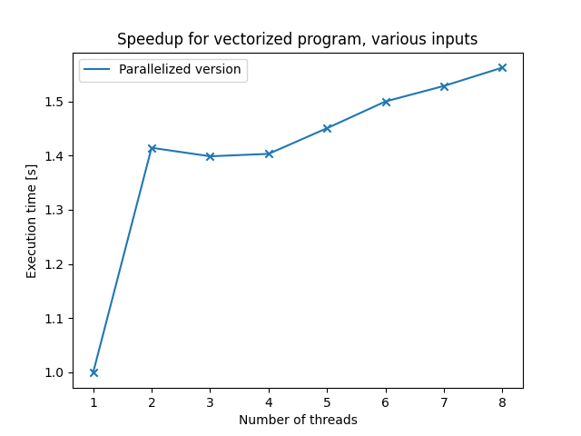

# Assignment 10

The program was analyzed twice: once with the --line flag, and onces without it.

#### Function based analysis

Without the --line flag, the program gets analyzed on a function level. The output first shows how much total time the program spent per function.

```
Each sample counts as 0.01 seconds.
  %   cumulative   self              self     total
 time   seconds   seconds    calls  ms/call  ms/call  name
 49.78      8.59     8.59      147    58.45    63.08  resid
 22.25     12.43     3.84      168    22.86    26.87  psinv
  8.40     13.88     1.45      147     9.87     9.87  interp
  8.29     15.31     1.43      147     9.73    13.73  rprj3
  7.19     16.55     1.24   131072     0.01     0.01  vranlc
  4.06     17.26     0.70      485     1.44     4.00  norm2u3
  0.06     17.27     0.01                             mg3P.constprop.2
  0.00     17.27     0.00   131642     0.00     0.00  randlc
  0.00     17.27     0.00        4     0.00     0.00  wtime_
```

The top time consuming function looks like this:

```c
static void resid(void *ou, void *ov, void *or, int n1, int n2, int n3,
                  double a[4], int k)
{
  double (*u)[n2][n1] = (double (*)[n2][n1])ou;
  double (*v)[n2][n1] = (double (*)[n2][n1])ov;
  double (*r)[n2][n1] = (double (*)[n2][n1])or;

  int i3, i2, i1;
  double u1[M], u2[M];

  if (timeron) timer_start(T_resid);
  for (i3 = 1; i3 < n3-1; i3++) {
    for (i2 = 1; i2 < n2-1; i2++) {
      for (i1 = 0; i1 < n1; i1++) {
        u1[i1] = u[i3][i2-1][i1] + u[i3][i2+1][i1]
               + u[i3-1][i2][i1] + u[i3+1][i2][i1];
        u2[i1] = u[i3-1][i2-1][i1] + u[i3-1][i2+1][i1]
               + u[i3+1][i2-1][i1] + u[i3+1][i2+1][i1];
      }
      for (i1 = 1; i1 < n1-1; i1++) {
        r[i3][i2][i1] = v[i3][i2][i1]
                      - a[0] * u[i3][i2][i1]
                      - a[2] * ( u2[i1] + u1[i1-1] + u1[i1+1] )
                      - a[3] * ( u2[i1-1] + u2[i1+1] );
      }
    }
  }
  if (timeron) timer_stop(T_resid);

  comm3(r, n1, n2, n3, k);

  if (debug_vec[0] >= 1) {
    rep_nrm(r, n1, n2, n3, "   resid", k);
  }

  if (debug_vec[2] >= k) {
    showall(r, n1, n2, n3);
  }
}
```

There are tree nested for loops in this function. This is the part which (probably) is the most time consuming. To verify this, we can look at the linewise analysis output.

### Line based analysis

The line based analysis produced output that is way too large to put in here, so there is only the relevant part included.

```
  %   cumulative   self              self     total
 time   seconds   seconds    calls  Ts/call  Ts/call  name
  8.78      1.52     1.52                             resid (real.c:526 @ 40411a)
  3.88      2.19     0.67                             resid (real.c:524 @ 4040c2)
  3.56      2.80     0.62                             psinv (real.c:464 @ 404e10)
  3.54      3.41     0.61                             resid (real.c:529 @ 40435c)
  2.90      3.91     0.50                             resid (real.c:523 @ 40408f)
  2.87      4.41     0.50                             resid (real.c:525 @ 40413f)
  2.75      4.88     0.48                             psinv (real.c:471 @ 405069)
  2.72      5.35     0.47                             resid (real.c:538 @ 404354)
  2.35      5.76     0.41                             resid (real.c:529 @ 404315)
  2.35      6.16     0.41                             resid (real.c:537 @ 40431b)
  2.17      6.54     0.38                             resid (real.c:525 @ 4040ee)
  2.06      6.89     0.36                             resid (real.c:537 @ 40432e)
  1.94      7.23     0.34                             resid (real.c:524 @ 4040ea)
  1.85      7.55     0.32                             resid (real.c:525 @ 404109)
  1.80      7.86     0.31                             psinv (real.c:462 @ 404dbd)
  1.65      8.14     0.29                             rprj3 (real.c:605 @ 4059a0)
```

The lines printed above are the top 15 time consuming lines in the program. As we can clearly see, most of those lines are in the function `resid` at the loop nest.

### How to parallelize the program

To parallelize this program, we would suggest to first parallelize the loop nest in the resid function. If this does not yield enough speedup, one can also look at the loop nest in the `psinv` function.

### Other information provided by the analysis

The analysis did also produce a call tree which indicates how much time of a function call has been spent in 'child' function calls.
We did not consider this information for our conclusion, but we are sure that it is useful for other people. Here is an example for a call tree given by gprof:

```
index % time    self  children    called     name
                                                 <spontaneous>
[1]    100.0    0.01   17.26                 mg3P.constprop.2 [1]
                8.59    0.68     147/147         resid [2]
                3.84    0.67     168/168         psinv [3]
                1.43    0.59     147/147         rprj3 [4]
                1.45    0.00     147/147         interp [6]
-----------------------------------------------
                8.59    0.68     147/147         mg3P.constprop.2 [1]
[2]     53.7    8.59    0.68     147         resid [2]
                0.25    0.43     170/485         norm2u3 [5]
-----------------------------------------------
                3.84    0.67     168/168         mg3P.constprop.2 [1]
[3]     26.1    3.84    0.67     168         psinv [3]
                0.24    0.43     168/485         norm2u3 [5]
-----------------------------------------------
                1.43    0.59     147/147         mg3P.constprop.2 [1]
[4]     11.7    1.43    0.59     147         rprj3 [4]
                0.21    0.38     147/485         norm2u3 [5]
-----------------------------------------------
                                   8             norm2u3 [5]
                0.21    0.38     147/485         rprj3 [4]
                0.24    0.43     168/485         psinv [3]
                0.25    0.43     170/485         resid [2]
[5]     11.2    0.70    1.24     485+8       norm2u3 [5]
                1.24    0.00  131072/131072      vranlc [7]
                0.00    0.00  131642/131642      randlc [8]
                                   8             norm2u3 [5]
-----------------------------------------------
                1.45    0.00     147/147         mg3P.constprop.2 [1]
[6]      8.4    1.45    0.00     147         interp [6]
-----------------------------------------------
                1.24    0.00  131072/131072      norm2u3 [5]
[7]      7.2    1.24    0.00  131072         vranlc [7]
-----------------------------------------------
                0.00    0.00  131642/131642      norm2u3 [5]
[8]      0.0    0.00    0.00  131642         randlc [8]
-----------------------------------------------
                0.00    0.00       2/4           timer_start [24]
                0.00    0.00       2/4           timer_stop [25]
[9]      0.0    0.00    0.00       4         wtime_ [9]
-----------------------------------------------
```

## Task 2

Like we have seen in task 1, we want to optimize the methods `psinv`,`resid` and `iterp` because those 3 function take the most execution time.

### First Attempts

At first, we focused on the `resid` function, because it has the longest execution time and has nested construct of 4 for-loops. So we tried to parallelize those or rather to optimize the whole nested for-loop construction.

But every try of collapsing the loops failed, because the calculations were wrong afterwards. Example of one attempt:

```c
#pragma omp parallel
{
#pragma omp for collapse(3)
for (i3 = 1; i3 < n3-1; i3++) {
for (i2 = 1; i2 < n2-1; i2++) {
for (i1 = 0; i1 < n1; i1++) {
u1[i1] = u[i3][i2-1][i1] + u[i3][i2+1][i1] + u[i3-1][i2][i1] + u[i3+1][i2][i1];
u2[i1] = u[i3-1][i2-1][i1] + u[i3-1][i2+1][i1] + u[i3+1][i2-1][i1] + u[i3+1][i2+1][i1];
}
}
}

#pragma omp for collapse(3)
for (i3 = 1; i3 < n3-1; i3++) {
for (i2 = 1; i2 < n2-1; i2++) {
for (i1 = 1; i1 < n1-1; i1++) {
r[i3][i2][i1] = v[i3][i2][i1] - a[0] _ u[i3][i2][i1]
//-------------------------------------------------------------------
// Assume a[1] = 0 (Enable 2 lines below if a[1] not= 0)
//-------------------------------------------------------------------
// - a[1] _ ( u[i3][i2][i1-1] + u[i3][i2][i1+1]
// + u1[i1] )
//------------------------------------------------------------------- - a[2] _ ( u2[i1] + u1[i1-1] + u1[i1+1] ) - a[3] _ ( u2[i1-1] + u2[i1+1] );
}
}
}
}
```

We also tried a lot of different adjustments to the pragmas, but even without collapse it calculated the wrong solution. The only thing that worked for us, is shown in the following part.

### Parallelized Code

nested for-loops from function `resid`:

```c
#pragma omp parallel for private(u1, u2) schedule(dynamic)
  for (i3 = 1; i3 < n3-1; i3++) {
    for (i2 = 1; i2 < n2-1; i2++) {
      for (i1 = 0; i1 < n1; i1++) {
        u1[i1] = u[i3][i2-1][i1] + u[i3][i2+1][i1]
               + u[i3-1][i2][i1] + u[i3+1][i2][i1];
        u2[i1] = u[i3-1][i2-1][i1] + u[i3-1][i2+1][i1]
               + u[i3+1][i2-1][i1] + u[i3+1][i2+1][i1];
      }
      for (i1 = 1; i1 < n1-1; i1++) {
        r[i3][i2][i1] = v[i3][i2][i1]
                      - a[0] * u[i3][i2][i1]
        //-------------------------------------------------------------------
        //  Assume a[1] = 0      (Enable 2 lines below if a[1] not= 0)
        //-------------------------------------------------------------------
        //            - a[1] * ( u[i3][i2][i1-1] + u[i3][i2][i1+1]
        //                     + u1[i1] )
        //-------------------------------------------------------------------
                      - a[2] * ( u2[i1] + u1[i1-1] + u1[i1+1] )
                      - a[3] * ( u2[i1-1] + u2[i1+1] );
      }
    }
  }
```

nested for-loops from function `psinv`:

```c
#pragma omp parallel for private(r1, r2) schedule(dynamic)
  for (i3 = 1; i3 < n3-1; i3++) {
    for (i2 = 1; i2 < n2-1; i2++) {
      for (i1 = 0; i1 < n1; i1++) {
        r1[i1] = r[i3][i2-1][i1] + r[i3][i2+1][i1]
               + r[i3-1][i2][i1] + r[i3+1][i2][i1];
        r2[i1] = r[i3-1][i2-1][i1] + r[i3-1][i2+1][i1]
               + r[i3+1][i2-1][i1] + r[i3+1][i2+1][i1];
      }
      for (i1 = 1; i1 < n1-1; i1++) {
        u[i3][i2][i1] = u[i3][i2][i1]
                      + c[0] * r[i3][i2][i1]
                      + c[1] * ( r[i3][i2][i1-1] + r[i3][i2][i1+1]
                               + r1[i1] )
                      + c[2] * ( r2[i1] + r1[i1-1] + r1[i1+1] );
        //--------------------------------------------------------------------
        // Assume c[3] = 0    (Enable line below if c[3] not= 0)
        //--------------------------------------------------------------------
        //            + c[3] * ( r2[i1-1] + r2[i1+1] )
        //--------------------------------------------------------------------
      }
    }
  }
```

nested for-loops from function `interp`:

```c
#pragma omp parallel for private(z1, z2, z3) schedule(dynamic)
    for (i3 = 0; i3 < mm3-1; i3++) {
      for (i2 = 0; i2 < mm2-1; i2++) {
        for (i1 = 0; i1 < mm1; i1++) {
          z1[i1] = z[i3][i2+1][i1] + z[i3][i2][i1];
          z2[i1] = z[i3+1][i2][i1] + z[i3][i2][i1];
          z3[i1] = z[i3+1][i2+1][i1] + z[i3+1][i2][i1] + z1[i1];
        }

        for (i1 = 0; i1 < mm1-1; i1++) {
          u[2*i3][2*i2][2*i1] = u[2*i3][2*i2][2*i1]
                              + z[i3][i2][i1];
          u[2*i3][2*i2][2*i1+1] = u[2*i3][2*i2][2*i1+1]
                                + 0.5 * (z[i3][i2][i1+1] + z[i3][i2][i1]);
        }
        for (i1 = 0; i1 < mm1-1; i1++) {
          u[2*i3][2*i2+1][2*i1] = u[2*i3][2*i2+1][2*i1]
                                + 0.5 * z1[i1];
          u[2*i3][2*i2+1][2*i1+1] = u[2*i3][2*i2+1][2*i1+1]
                                  + 0.25 * (z1[i1] + z1[i1+1]);
        }
        for (i1 = 0; i1 < mm1-1; i1++) {
          u[2*i3+1][2*i2][2*i1] = u[2*i3+1][2*i2][2*i1]
                                  + 0.5 * z2[i1];
          u[2*i3+1][2*i2][2*i1+1] = u[2*i3+1][2*i2][2*i1+1]
                                  + 0.25 * (z2[i1] + z2[i1+1]);
        }
        for (i1 = 0; i1 < mm1-1; i1++) {
          u[2*i3+1][2*i2+1][2*i1] = u[2*i3+1][2*i2+1][2*i1]
                                  + 0.25 * z3[i1];
          u[2*i3+1][2*i2+1][2*i1+1] = u[2*i3+1][2*i2+1][2*i1+1]
                                    + 0.125 * (z3[i1] + z3[i1+1]);
        }
      }
    }
```

With those modifications, the calculations are still correct and we achieve a maximum speed-up of 1.6 using 8 threads. That is almost half the time from the beginning with only 3 additional lines of code.

### Results

In the table below are the measured execution times for different amounts of threads. `Reference` shows the time for the given base version and `Parallelized version` shows the times for the optimized code.

| Number of threads | Reference | Parallelized version |
| ----------------- | --------- | -------------------- |
| 0                 | 17.61     | 17.63                |
| 1                 | 17.61     | 12.45                |
| 2                 | 17.61     | 12.59                |
| 3                 | 17.61     | 12.55                |
| 4                 | 17.61     | 12.14                |
| 5                 | 17.61     | 11.74                |
| 6                 | 17.61     | 11.52                |
| 7                 | 17.61     | 11.27                |

This results in following speed-up values:


