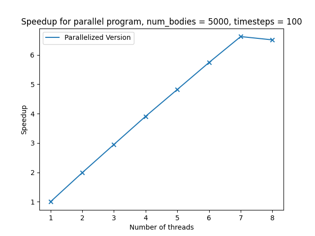
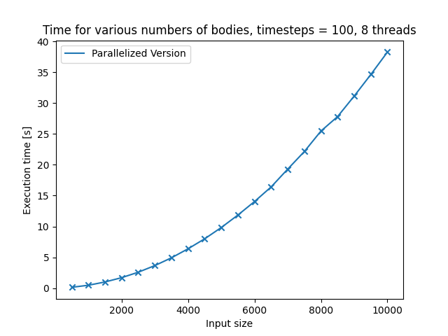
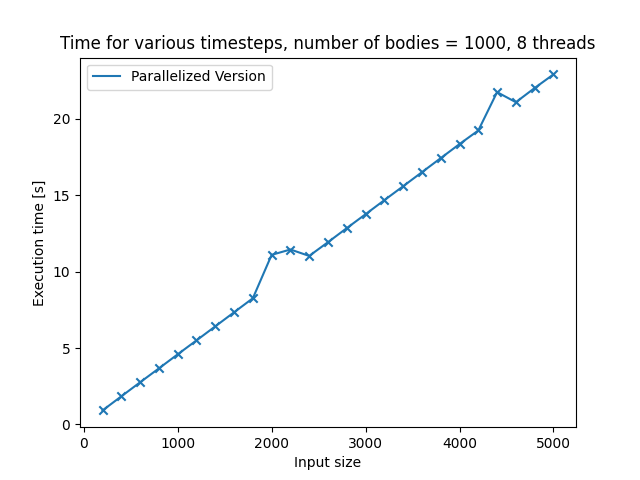

# Assignment 12

### Introduction

The task was to implement a 3-D n-body simulation. Although there are quite fast and clever algorithms for this problem like the [Barnes-Hut-Algorithm](https://de.wikipedia.org/wiki/Barnes-Hut-Algorithmus), we decided to implement the naive version, which has a runtime complexity of $\mathcal{O}(n^2)$.
In the naive approach, every body compares its position directly to every other body, calculates the force between them and then updates its velocity and position accordingly.

### Implementation

Each particle gets represented by a struct containing information about the mass, velocity and position of the body. Note that position and velocity consist of three components (one for every dimension).

```c
typedef struct body_struct {
    float position[3];
    float velocity[3];
    int mass;
} body;
```

Following functions which are necessary for the simulation are provided in `n_body.c`:

#### Initialization

Every body gets initialized with a random mass, a velocity of 0 and a random position in the predefined space.

```c
void initialize_bodies(body* bodies, int size){
    srand(time(NULL));
    unsigned int seed = rand();
    for (int i = 0; i<size; ++i){
        for (int j = 0; j<3; ++j){
            bodies[i].position[j] = rand_r(&seed) % MAX_DIM;
            bodies[i].velocity[j] = 0;
        }
        bodies[i].mass = ((rand_r(&seed) % MAX_MASS) + 500) * 1000;
    }
}
```

#### Updating velocity

The velocities get updated as described in [the introduction section](#Introduction). Note that the force on an axis gets set to 0 as soon as bodies get too close, since we wanted to avoid absurdly high accelarations which can occur since we did not implement any collision model. 

```c
void update_velocities_naive(body* bodies, int size){
    for (int i = 0; i<size; ++i){
        for (int j = 0; j<size; ++j){
            if(i != j){
                float numerator = G * (bodies[i].mass + bodies[j].mass);
                for (int k = 0; k<3; ++k){
                    float radius = calculate_radius_squared(bodies[i].position[k], bodies[j].position[k]);
                    float force;
                    if (fabs(radius) < 0.5){
                        force = 0;
                    } else{
                        force = numerator / radius;
                    }
                    bodies[i].velocity[k] += force/bodies[i].mass;
                }
            }
        }
    }
}
```

#### Updating position

The positions also get updated as described in [the introduction section](#Introduction). Note. that the velocity of a body gets set to 0 as soon as the simulation boundaries are reached.

```C
void update_positions(body* bodies, int size){
    for (int i = 0; i<size; ++i){
        for (int j = 0; j<3; ++j){
            float update = bodies[i].position[j] + bodies[i].velocity[j];
            if (update > MAX_DIM){
                bodies[i].velocity[j] = 0;
            }else if(update<0){
                bodies[i].velocity[j] = 0;
            } else{
                bodies[i].position[j] = update;
            }  
        }
    }
}
```

#### Saving the data to a file

In order to visualize the simulation it is necessary to write the position of each particle to a file. To achive this, the following function is provided:

```c
void print_bodies_to_file(body* bodies, int size){
    FILE* file = fopen (OUT_FILE, "a");
    for (int j = 0; j<3; ++j){
        for (int i = 0; i<size; ++i){
            fprintf(file, "%f ", bodies[i].position[j]);
        }
        fprintf(file, "\n");
    }
    fprintf(file, "\n");
    fclose(file);
}
```


#### Putting it all together

The main simulation loop is defined in the main function in `simulation.c`. Note that nothing is written to the file if the program is compiled with the `TIME_MES` flag.

```c
for (int i = 0; i<steps; ++i){
        update_velocities_naive(bodies, size);
        update_positions(bodies, size); 
        #ifndef TIME_MES
        print_bodies_to_file(bodies, size);
        #endif
    }
```

### Visualization of the simulation

We visualized the simulation with a custom python script using matplotlib. In order to run the script, one need to have matplotlib and numpy installed.
Here is an example of the generated plot:


#### Some observations

- Some points are very fast. This is due to some points are initialized with a very low mass and therefore get accellerated quite violently. 
- The simulation probably needs some fine tuning in terms of parameters (e.g. the masses of particles and the gravitaional constant).
- A collision model would be very benefitial because we could avoid using workarounds (described in [here](#Updating-velocity)) which currently lead to odd behaviour of the particles.  

### Parallel version

In order to parallelize the code, we added two simple statements in the most computationally intensive functions:

```c
void update_positions(body* bodies, int size){
    #pragma omp parallel for collapse(2)
    for (int i = 0; i<size; ++i){
        for (int j = 0; j<3; ++j){
          ...
        }
    }
}
```

and 

```c
void update_velocities_naive(body* bodies, int size){
    #pragma omp parallel for collapse(2)
    for (int i = 0; i<size; ++i){
        for (int j = 0; j<size; ++j){
        	...
        }
    }
}
```

#### Benchmark

The program has been tested with `n_bodies` = 5000 and `timesteps`= 100.



| Number of threads | Parallelized Version | Reference |
| ----------------- | -------------------- | --------- |
| 1                 | 74.01                | 74.0      |
| 2                 | 37.25                | 74.06     |
| 3                 | 25.08                | 73.98     |
| 4                 | 18.93                | 73.99     |
| 5                 | 15.34                | 73.97     |
| 6                 | 12.89                | 74.0      |
| 7                 | 11.18                | 74.05     |
| 8                 | 11.36                | 73.97     |

  We are quite happy with this (nearly linear) speedup and especially with the effort to speedup ratio. 


### Time measurements for various inputs

#### Varriyng the number of bodies

Measurements have been taken with 100 timesteps and 8 threads for various numbers of bodies.





| Number of bodies | Execution time |
| ---- | ---- |
| 500 | 0.14 |
| 1000 | 0.47 |
| 1500 | 1.0 |
| 2000 | 1.7 |
| 2500 | 2.58 |
| 3000 | 3.66 |
| 3500 | 4.92 |
| 4000 | 6.38 |
| 4500 | 8.0 |
| 5000 | 9.83 |
| 5500 | 11.85 |
| 6000 | 14.04 |
| 6500 | 16.41 |
| 7000 | 19.3 |
| 7500 | 22.15 |
| 8000 | 25.47 |
| 8500 | 27.81 |
| 9000 | 31.14 |
| 9500 | 34.63 |
| 10000 | 38.27 |

One can clearly see the exponentially rising runtime (which fits our asymptotic complexity of $\mathcal{O}(n^2)$.

#### Varriyng number of timesteps

Measurements have been taken with 1000 bodies and 8 threads for various numbers of timesteps.



| Input size | Parallelized Version |
| ---------- | -------------------- |
| 200        | 0.92                 |
| 400        | 1.84                 |
| 600        | 2.76                 |
| 800        | 3.67                 |
| 1000       | 4.59                 |
| 1200       | 5.5                  |
| 1400       | 6.42                 |
| 1600       | 7.34                 |
| 1800       | 8.26                 |
| 2000       | 11.1                 |
| 2200       | 11.45                |
| 2400       | 11.03                |
| 2600       | 11.93                |
| 2800       | 12.85                |
| 3000       | 13.76                |
| 3200       | 14.68                |
| 3400       | 15.59                |
| 3600       | 16.51                |
| 3800       | 17.43                |
| 4000       | 18.35                |
| 4200       | 19.24                |
| 4400       | 21.75                |
| 4600       | 21.09                |
| 4800       | 22.02                |
| 5000       | 22.91                |

This curve also fullfills our expecation, since the progam has a linear runtinme complexity ($\mathcal{O}(n)$) in the number of timesteps.
